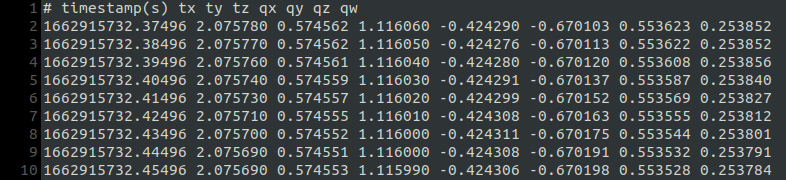
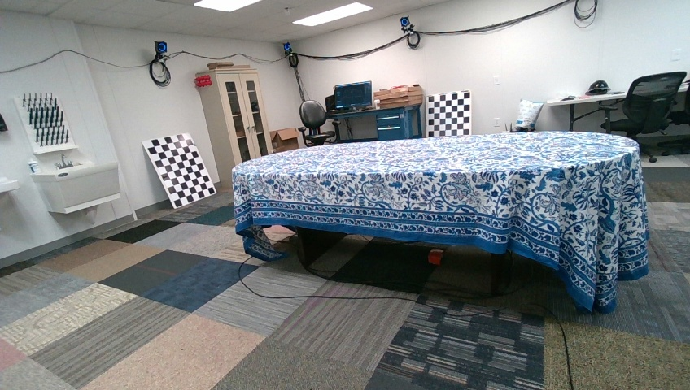

# parsing ROSBag files with sync data
### Dependencies
- OpenCV (with Contrib)
- Eigen
- ROS
- cv_bridge
- Sensor_mgs
- Realsense-ros

---
### Parameters (in `include.h`)
(1) `SAVE_IMG`
- Not save images &rarr; 0
- Save images &rarr; 1

(2) `PUBLISH_SYNCED_IMGS`
- Use publish ROS topic &rarr; true
- Not use publish ROS topic &rarr; false

(3) `DIFF_THRESHOLD`
- Set different between current time and lastest time &rarr; ${VALUE}

(4) `SYNC_GT_TIME`
- Sync with GT and image time &rarr; true
- Not use GT info &rarr; false

(5) `SIM_THRESHOLD`
- To set GT boundary near by current image &rarr; ${VALUE}

(6) `std::string gt_path`
- To write GT absolute path &rarr; ${STRING}

---
### Input Data

(1) sensor_msgs::CameraInfo
- /camera/camera/color/camera_info
- /camera/camera/depth/camera_info
- /camera/camera/infra1/camera_info
- /camera/camera/infra2/camera_info  
  
(2) sensor_msgs::CompressedImage 
- /camera/camera/color/image_raw/compressed
- /camera/camera/infra1/image_rect_raw/compressed
- /camera/camera/infra2/image_rect_raw/compressed  

(3) sensor_msgs::Image
- /camera/camera/depth/image_rect_raw  

---
### Output Data
(1) sensor_msgs::Image
- /sync_color
- /sync_depth
- /sync_infra1

(2) Save Sync Color and Depth Image (.jpg)
- If you want to save .png extension image, please go to saveSyncImgs funtion and change .jpg to .png !!
- Default saved image is **3 FPS** in rosbag time !!
  - If you want to save more images, then please change double value in `time_diff` statement ! (in this code, setting 0.25)

(3) Save the Image Concerning Sync Color time and GT time Image (.jpg)
- You can set the time to sync with gt. By adjusting `SIM_THRESHOLD`, you can set an image that fits the range of GT ! (in this code, setting 0.01)

---
### Exmaple
- example of [ar table dataset](https://github.com/rpng/ar_table_dataset.git) 
  - In the result, the only image is saved as **00002.jpg**, and the image parsed according to GT time is saved as **gt_2_1662915732.374960.jpg**.

<table>
  <tr>
    <td> GT text file (looking at Line 2)</td>
  </tr>   
  <tr>
    <td>  </td>
  </tr> 
</table>

<table>
  <tr>
     <td> Only image parsing </td>
     <td> Parsing image depend on GT time (line 2) </td>
  </tr> 
  <tr>
     <td>  </td>
     <td>  </td>
  </tr>
</table>
  
---
### Future Work
- I will sync all other images !
- Parameters in include.h will be changed to config.yaml !
